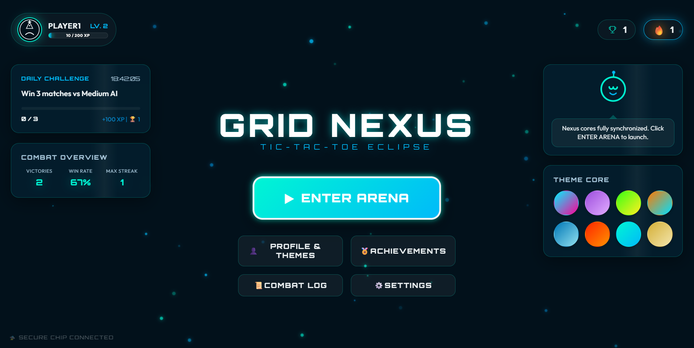
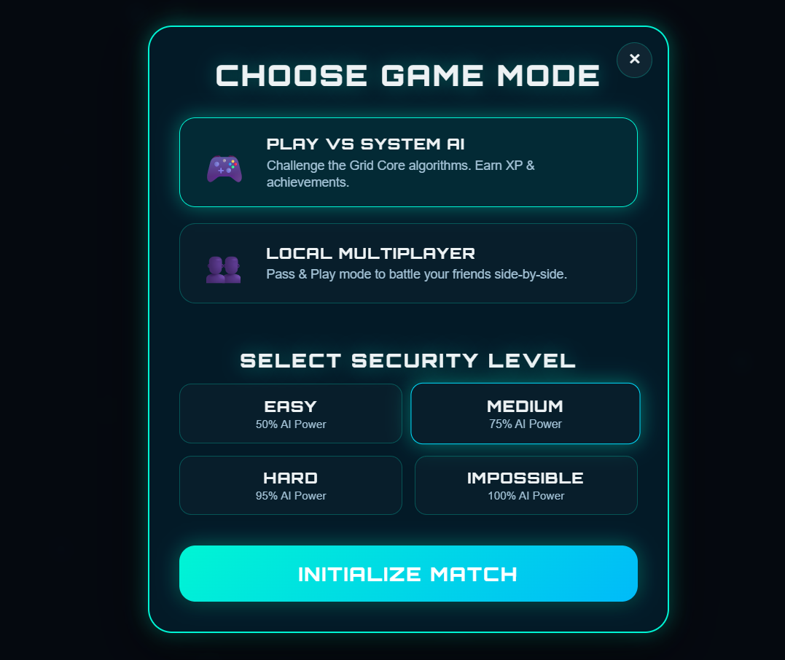
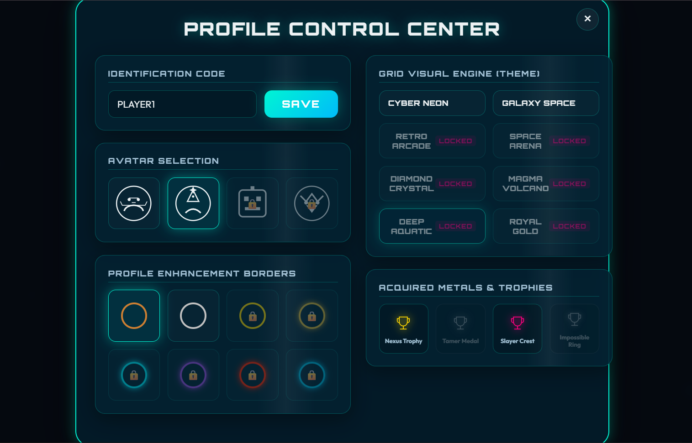
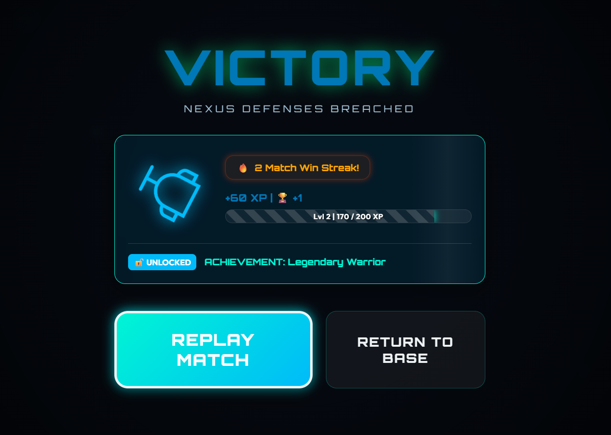

# 🎮 Grid Nexus - Ultimate Tic-Tac-Toe

> **A premium, futuristic Tic-Tac-Toe game with immersive gameplay, intelligent AI, progression mechanics, achievements, dynamic themes, and cinematic animations.**

Grid Nexus transforms the classic Tic-Tac-Toe experience into a modern browser game with stunning visuals, smooth animations, rewarding progression, and an engaging user experience. Designed with a game-first approach, it delivers an experience inspired by modern titles rather than a traditional web application.

---

## 🌟 Live Demo

🔗 **Live Website:** https://ayushisingh411.github.io/SCT_WD_3/

🔗 **GitHub Repository:** https://github.com/AyushiSingh411/SCT_WD_3

---

# 📖 Overview

Grid Nexus is a modern reimagining of the classic Tic-Tac-Toe game featuring intelligent AI opponents, cinematic gameplay, progression systems, unlockable achievements, customizable player profiles, immersive animations, dynamic themes, and responsive design.

Unlike traditional Tic-Tac-Toe implementations, Grid Nexus provides a complete gaming experience with beautiful UI/UX, premium visual effects, and engaging gameplay mechanics.

---

# ✨ Features

## 🎮 Multiple Game Modes

- 🤖 Play Against AI
- 👥 Local Multiplayer

---

## 🧠 Intelligent AI

Choose your challenge:

- 🟢 Easy
- 🔵 Medium
- 🟠 Hard
- 🔴 Impossible

The Impossible AI uses an optimal strategy, making it extremely difficult to beat.

---

## 🎨 Premium Themes

Switch between beautiful game worlds including:

- ⚡ Cyber Neon
- 🌌 Galaxy
- 🕹️ Arcade
- 🚀 Space Arena
- 💎 Crystal
- 🌋 Volcano
- 🌊 Ocean
- 👑 Royal Gold

Each theme transforms the entire visual experience.

---

## 👤 Player Customization

Customize your profile with:

- Username
- Avatar
- Unlockable Borders
- Theme Selection

---

## 🏆 Achievements

Unlock exciting achievements like:

- 🥇 First Victory
- ⚡ Win Streak
- 🤖 AI Slayer
- 🎯 Perfect Match
- 👑 Theme Master

Achievements are saved automatically.

---

## 📈 Progression System

Gain XP after every match.

Level up by winning games and unlock:

- New Themes
- Borders
- Achievements
- Player Progress

---

## 📊 Player Statistics

Track your performance with:

- Total Games
- Wins
- Losses
- Draws
- Win Percentage
- Highest Win Streak
- Fastest Victory
- Longest Match
- Favorite Game Mode

---

## 🎉 Premium Gameplay Experience

Enjoy:

- Smooth Animations
- Glowing Effects
- Cinematic Victory Screen
- Confetti
- Fireworks
- XP Animations
- Floating Particles
- Interactive Hover Effects

---

## 🔊 Dynamic Sound Effects

Synthesized using the Web Audio API.

Includes:

- Button Click
- Hover
- Move Placement
- Victory
- Defeat
- Level Up
- Ambient Background Sound

---

## 💾 Persistent Progress

Game data is automatically saved, including:

- Player Profile
- XP
- Levels
- Match History
- Achievements
- Themes
- Statistics
- Preferences

No progress is lost after refreshing the page.

---

## 📱 Fully Responsive

Optimized for:

- 💻 Desktop
- 💼 Laptop
- 📱 Mobile
- 📟 Tablet

---

# 🚀 Game Flow

```
Splash Screen
      │
      ▼
Main Menu
      │
      ▼
Choose Mode
      │
      ▼
Choose Difficulty
      │
      ▼
Game Arena
      │
      ▼
Victory / Defeat
      │
      ▼
XP & Rewards
      │
      ▼
Achievements
      │
      ▼
Play Again
```

---

# 🎯 Key Highlights

✅ Premium Game UI

✅ Multiple AI Difficulties

✅ Intelligent AI Opponent

✅ Progression System

✅ XP & Levels

✅ Unlockable Achievements

✅ Dynamic Themes

✅ Profile Customization

✅ Match History

✅ Responsive Design

✅ Modern Animations

✅ Particle Effects

✅ Sound Effects

✅ Local Data Persistence

---

# 📸 Screenshots

## 🏠 Main Menu



---

## 🎮 Gameplay



---

## 🤖 AI Gameplay

.png)

---

## 👤 Profiles & Themes



---

## 🏆 Victory Screen


# 🎲 How to Play

1. Launch the game.
2. Select a game mode.
3. Choose AI difficulty (if applicable).
4. Play by placing your symbol.
5. Win matches to earn XP.
6. Unlock achievements.
7. Customize your profile.
8. Climb the leaderboard of your own progress.

---

# 💡 Future Enhancements

- 🌐 Online Multiplayer
- 👥 Friend Invite System
- ☁️ Cloud Save
- 🏅 Global Leaderboard
- 🎤 Voice Effects
- 🎁 Daily Rewards
- 🎯 Missions & Challenges
- 🎮 Controller Support
- 🌍 Multiplayer Matchmaking
- 🔥 Seasonal Events

---

# 📂 Project Structure

```
SCT_WD_3/
│
├── index.html
├── styles.css
├── app.js
├── README.md
├── assets/
│   ├── images/
│   ├── icons/
│   ├── audio/
│   └── fonts/
└── screenshots/
```

---

# 🌐 Browser Compatibility

Supports all modern browsers including:

- Google Chrome
- Microsoft Edge
- Mozilla Firefox
- Brave
- Opera
- Safari

---

# 👩‍💻 Author

### Ayushi Singh

🎓 B.Tech Computer Science Engineering Student

📍 Heritage Institute of Technology, Kolkata

---

### 🔗 Connect with Me

**GitHub**

https://github.com/AyushiSingh411

**LinkedIn**

https://www.linkedin.com/in/ayushi-singh-984a43325

---

# ⭐ If you like this project...

Give it a ⭐ on GitHub!

---

# 📜 License

This project was developed for learning, portfolio, and internship purposes.

Feel free to explore, learn, and build upon it.

---

## 💜 Thank You for Visiting Grid Nexus!

*"Master the Grid. Defeat the AI. Become the Champion."* 🎮
